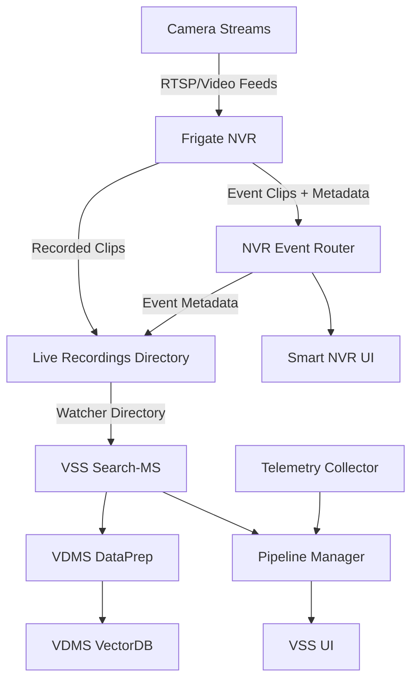

# Live Video Search Architecture

This document describes the end‑to‑end architecture of Live Video Search and how Smart NVR and VSS Search integrate.

## High‑Level Architecture

## Data Flow

1. **Ingestion**: Cameras stream into Frigate, which records clips and publishes events via MQTT.
2. **Event Routing**: NVR Event Router receives events and associates clips with camera metadata.
3. **Indexing**: The shared recordings directory is watched by VSS Search‑MS. Clips are pushed to DataPrep, embedded, and stored in VDMS.
4. **Querying**: Users query VSS UI with optional time‑range filters. Search‑MS retrieves and ranks relevant clips.
5. **Visualization**: Results are shown in VSS UI while Smart NVR UI remains available for live context.
6. **Telemetry**: Collector streams system metrics to Pipeline Manager and the UI.

## Integration Points

- **Shared recordings path** ties Smart NVR output directly to VSS Search input.
- **Pipeline Manager endpoints** unify search configuration and retrieval.
- **Telemetry WS** provides live metrics for operational visibility.

## Related Architecture References

- Smart NVR architecture: [Smart NVR Overview](../../../../smart-nvr/docs/user-guide/index.md)
- VSS Search architecture: [Video Search and Summarization Docs](https://github.com/open-edge-platform/edge-ai-libraries/blob/main/sample-applications/video-search-and-summarization/docs/user-guide/overview-architecture-search.md)
